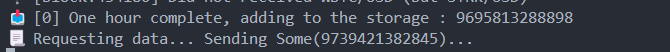

# Tech test

## ⚠️ Ceci est une mise à jour ⚠️

L'original est : [b67a0803282870c99acbe166c16f87d547057cbf](https://github.com/Guitheg/tech-test/tree/b67a0803282870c99acbe166c16f87d547057cbf)

## Blockchain interaction

Dans cette partie, j'écoute les events de SubmittedSpotEntry avec l'addresse du contrat associé sur Sepolia.

- Dans un premier temps je récupère un certains nombre d'events (depuis les 20 derniers blocks),

- Dans un deuxième temps j'attends les nouveaux.

Ma fonction qui écoute les events renvois directement un receiver, ce qui pourra dans le future me permettre de traiter les events.

Je n'ai pas réussi à filtrer les events directement à partir du pair id puisqu'il me semble que l'info n'est que dans data, donc j'ai du le faire à la main.

Je suis plutôt satisfait de ce que j'ai fais sur cette partie.

## Data processing

1. Ce que j'ai fais c'est que je me sers de la valeur calculé précédemment pour calculer la nouvelle valeur. En gros, je normalise les "temps" par rapport à la période, et je calcul la moyenne en pondérant les valeurs par rapport à leur temps normalisé. Si, la nouvelle valeur appartient à une autre periode (l'heure suivante), je repars de zéro et ainsi de suite.

2. Je n'ai encore fait la partie signature

Pour le TWAP je suis plutôt satisfait.

## API Development

En ayant séparé chaque traitement dans un thread à part et en gérant bien son AppState j'ai eu beaucoup plus de facilité à réaliser cette partie.

La signature n'ayant pas été faite, il n'y a pas cette feature.


##

Dans l'ensemble, je trouve qu'il y a eu une bonne amélioration. Surtout avec l'apport des tests automatiques.

## Launch

Make sure you have set your `INFURA_API_KEY` env variable

Launch the server with a 'REST' Api
```
sh launch.sh
```

On another terminal, to get the data from the api:

```
python script/get_data.py
```

##

Quelques images illustrant le fonctionnement de l'app

Démarrage du serveur


Requête depuis le navigateur 


Côté serveur


Les tests automatiques

